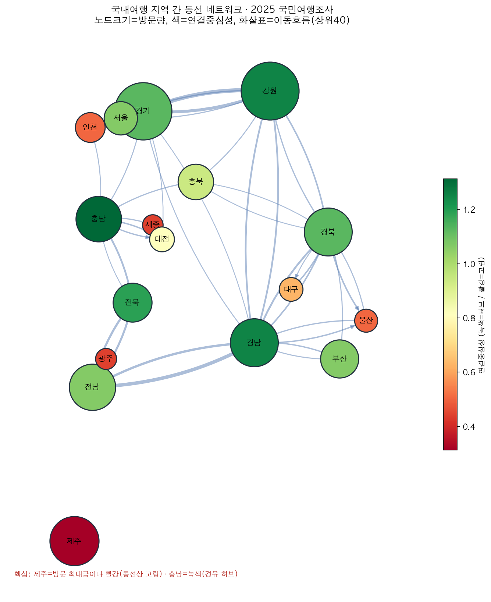
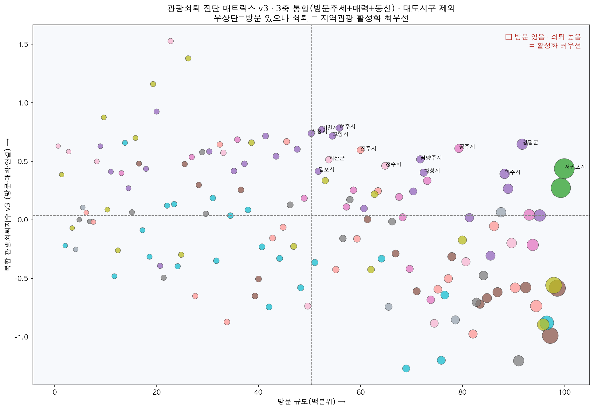
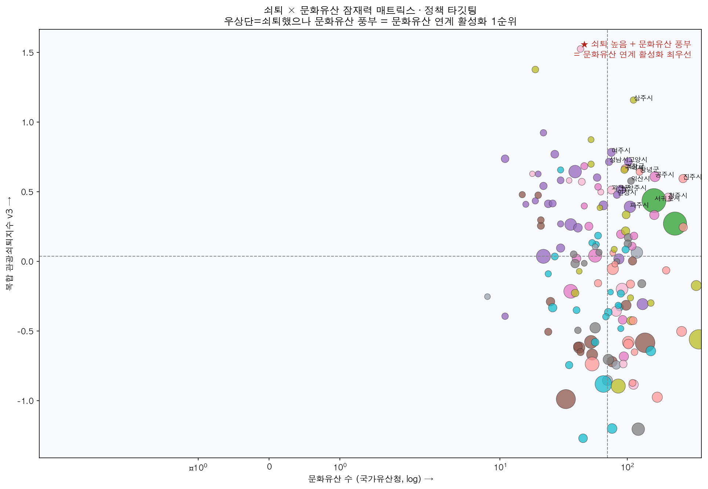

# 데이터로 진단하는 지역 관광쇠퇴

**동선 네트워크와 복합 관광쇠퇴지수로 찾는 활성화 우선지역, 그리고 문화유산·한류 연계 처방**

> 2026 관광데이터 분석 포스터 공모전 (한국문화관광연구원 관광지식정보시스템 · TourGo) 출품 작업 저장소

---

## 1. 문제의식

국내 관광은 수도권·제주·강원 등 소수 허브에 편중돼 있다. 그러나 지역 관광의 위기는 단순히 "방문객이 적은 곳"이 아니라, **① 방문이 줄고(추세) · ② 매력이 약화되며(재방문·만족) · ③ 동선에서 소외되는(네트워크)** 다차원적 쇠퇴로 나타난다. 본 프로젝트는 관광지식정보시스템의 필수 데이터를 바탕으로 **복합 관광쇠퇴지수**를 설계해 활성화 우선지역을 정량 진단하고, **문화유산·한류 연계 루트**라는 처방까지 하나의 데이터 파이프라인으로 연결한다.

## 2. 데이터

| 데이터 | 용도 | 비고 |
|---|---|---|
| **국민여행조사 2025 (국내여행 원자료)** | 동선 네트워크(방문 순서) · 매력(재방문·추천의향) | 52,185명, 방문지 시군구 231코드, 방문차수6×방문지17 |
| **한국관광공사 지역별 방문자수 API** (data.go.kr 15101972) | ① 방문 추세축 (외지인, 2019·2022·2024) | 행정표준코드, 일별→연간합산 |
| **국가유산청 국가유산 검색 API** (cha.go.kr, 무인증키) | 문화유산 밀도·좌표(잠재력축·루트) | 전국 지정 15,728건 |
| 외래관광객조사 (보조) | 한류·유적지 방문활동(인바운드 정책) | K-콘텐츠 레버 |

## 3. 방법론

### 3.1 관광 동선 네트워크
국민여행조사의 **방문 순서**(1→2→3번째 방문지)를 방향 엣지(A→B), 지역을 노드로 하는 네트워크를 구성하고 표본가중치(WT_DOM)로 전국 복원. degree/betweenness 중심성으로 허브·소외를 측정한다.

### 3.2 복합 관광쇠퇴지수 (3축, 표준화 등가중)
- **① 방문쇠퇴** = z(−회복률 24/19) + z(−최근추세 24/22)  [방문자수 API]
- **② 매력쇠퇴** = z(−재방문의향) + z(−추천의향)  [국민여행조사 A10·A11]
- **③ 연결소외** = z(−연결중심성)  [동선 네트워크]

### 3.3 방법론적 검증 서사
초기 '무숙박률(당일방문)'을 경유지화 지표로 썼으나 **대도시 근교 입지와 교란**(의왕·과천 오탐)을 발견 → **재방문·추천 의향으로 교체**(검증: 재방문 최고 강진·영암·고흥·장흥, 최저 진천·괴산) → 방문추세 결합 → **3축 정렬**로 견고성 확보. 이 '지표 교란 발견 → 교체 → 검증' 과정 자체가 지수의 신뢰성을 담보한다.

분석은 전국 시·군을 대상으로 하되, 활성화 **타깃 선정**은 인구 50만 미만 시·군으로 한정한다(지방자치법상 대도시 기준). 대도시(고양·성남·시흥 등)를 타깃에서 제외하는 근거는 크기가 아니라 ① **정책 범위** — 지방 관광 활성화의 대상이 아니라는 점 ② **데이터 특성** — 방문자수 데이터가 대도시에서는 통근·업무 등 비관광 통행에 오염되어 관광 신호를 왜곡한다는 점(무숙박률 교란과 동일한 논리)이다. 제외한 대도시는 지도에 '**대도시권 참고**'로 별도 표시한다. (인구 기준 제외로 대도시의 진성 매력쇠퇴 신호 일부가 손실될 수 있다는 점은 한계로 남는다.)

## 4. 핵심 결과

### 방문량 ≠ 연결성 — 동선 네트워크
제주는 방문 최대급이나 연결중심성 최하위(고립), 충남은 방문 중위이나 연결 1위(경유 허브). 연결중심성은 방문량과 **비중복**인 새로운 정보다.



### 복합 관광쇠퇴지수 진단
3축이 모두 쇠퇴로 정렬된 가장 견고한 타깃은 **울릉군**(방문↓+매력↓+연결↓, 섬 접근성), 이어 청송군·의정부시. 활성화 최우선 사분면: 여주·이천·괴산·상주·진천·공주·청주·금산·거창·함평.



### 자원 기반 타깃 유형화 — 문화유산 결합
국가유산 밀도(전국 15,728건)와 교차해 타깃을 두 유형으로 구분:
- **문화유산형**(쇠퇴+유산 풍부): 상주·창녕·공주·진주·익산·괴산·청주·서귀포 → 문화유산 연계 루트 유효
- **자연·힐링형**(쇠퇴+유산 희소): 울릉·청송 → 자연·체류 콘텐츠 전략



## 5. 인터랙티브 지도 (`map/`)

기존 지도 데모를 재활용해 국내 관광쇠퇴 진단용으로 개편. 2개 탭:
- **관광쇠퇴 진단** — 활성화 타깃 16개 시군구 마커(복합쇠퇴지수)
- **문화유산 추천 루트** — 창녕 가야·신라 문화유산 7스톱 동선(진흥왕 척경비·관룡사·화왕산성·교동송현동 고분군·우포늪)

```bash
cd map && python3 -m http.server 8899   # 또는 start.command 더블클릭
# http://localhost:8899
```

## 6. 저장소 구조
```
├─ README.md
├─ docs/            보고서 초안(3~5장) + 전체 골격
├─ figures/         분석 그림 4종 (네트워크·매트릭스)
├─ map/             인터랙티브 지도 (map-3-tourgo)
└─ analysis/        분석 코드 + 데이터 산출물
```

## 7. 재현 (analysis/)
- `analysis/pull_locgo.py` — 방문자수 API로 시군구 외지인 연간 방문 수집 (**data.go.kr 서비스키 필요** — `YOUR_DATA_GO_KR_SERVICE_KEY` 교체)
- 국가유산 API는 무인증키. 자세한 파이프라인은 `analysis/README.md` 참조.

## 8. 한계
- 국민여행조사 단일연도(구조 중심) → 방문추세는 방문자수 API로 보강
- 방문자수(통신데이터)는 일 단위 중복 정의, 행정표준코드↔설문코드 매칭(시도명+시군구명, 190/191)
- 통합시(구 분할) 매칭 한계

## 9. 주의
- 지도(`map/`)의 Routo 지도 키는 데모용. 재배포 시 본인 키로 교체 권장.
- 분석 스크립트의 data.go.kr 개인키는 제거됨(placeholder).
